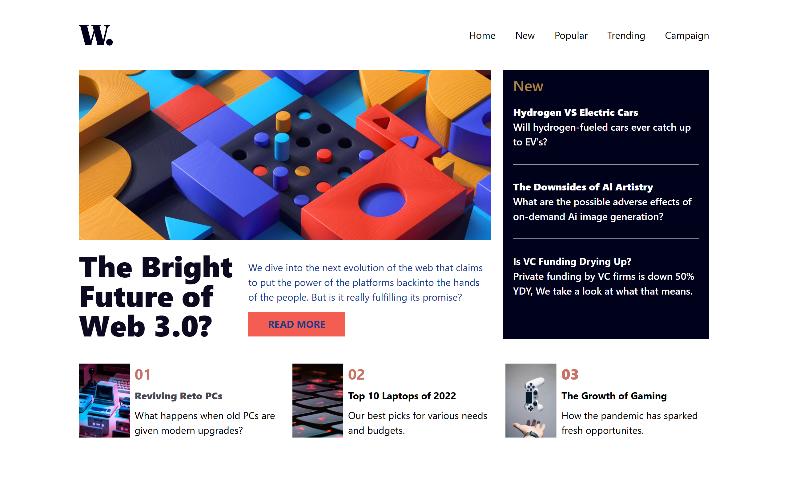
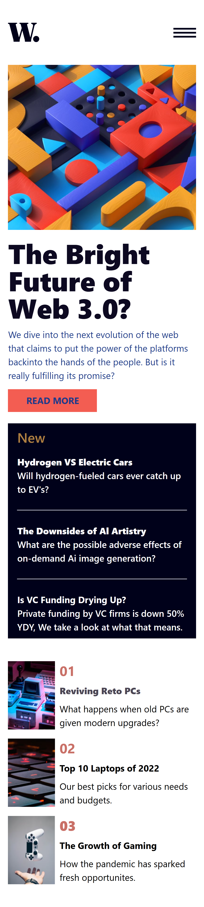

# News Homepage

This is a solution to the News Homepage challenge from Frontend Mentor.

## 📌 Overview

A responsive news homepage built with HTML and Tailwind CSS, focused on modern layouts, typography, and responsive design principles.

## 🚀 Features

* Responsive layout across devices
* Clean and modern news-style design
* Structured content sections
* Interactive navigation elements
* Accessible and semantic HTML structure

## 🛠️ Built With

* HTML5
* Tailwind CSS
* Flexbox
* CSS Grid

## 📷 Screenshots

### Desktop View

### Mobile View

## 🔗 Live Demo

[View Live Site](https://interactive-dropdownproject.vercel.app/)

## 📁 Repository

[GitHub Repo](https://github.com/MorakinyoErioluwa/Newspage-Homepage-Project.git)

## 📌 What I Learned

* Building responsive layouts with CSS Grid
* Structuring content-heavy interfaces
* Managing typography and visual hierarchy
* Creating adaptable layouts for different screen sizes
